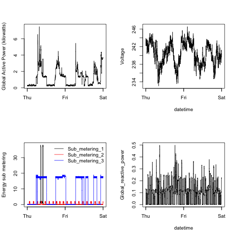

Exploratory Data Analysis Assignment 1
================================

## Running the scripts

*Preconditions:*  It is assumed you have the original dataset for this project Electric power consumption  downloaded from https://d396qusza40orc.cloudfront.net/exdata%2Fdata%2Fhousehold_power_consumption.zip and unzipped to the base folder of this project in a file named household_power_consumption.txt.   In addition please install dplyr, lubridate before executing this code.

There are separate scripts for plotting each of the charts called plot1.R, plot2.R, plot3.R and plot4.R respectively.  There is also a util.R file with a single function that loads, subsets and cleans up the electrical data so it is ready to be plotted. To plot the charts source each of these files in turn:  
For example,  
source("plot1.R")
will generate plot1.png.

The four plots below were generated by these files. 

### Plot 1

 

### Plot 2

 

### Plot 3

 

### Plot 4

 
